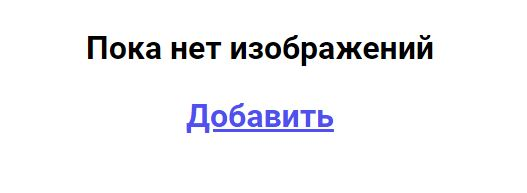

# Галерея

## О приложении

Настоящее приложение состоит из двух компонентов:

1. Галерея с изображениями
2. Панель настроек галереи

## Галерея с изображениями

Блок галереи имеет шапку (header). В правом углу шапки расположена кнопка открытия панели настроек (будет описана далее). 
Если галерея пуста, будет выведено сообщение: 
 
При клике по **"Добавить"** также открывается панель настроек